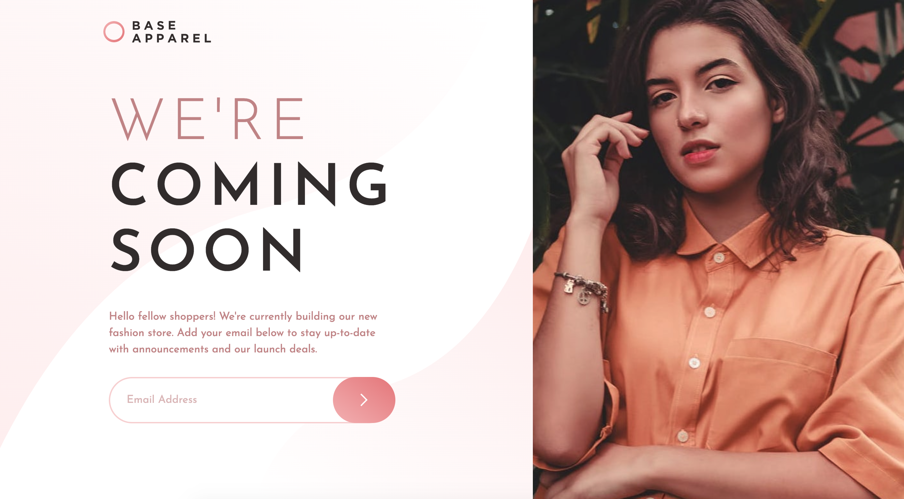

# Frontend Mentor - Base Apparel coming soon page solution

## Welcome! 👋

This is a solution to the [Base Apparel coming soon page challenge on Frontend Mentor](https://www.frontendmentor.io/challenges/base-apparel-coming-soon-page-5d46b47f8db8a7063f9331a0). Frontend Mentor challenges help you improve your coding skills by building realistic projects.

## Table of contents

- [Overview](#overview)
  - [The challenge](#the-challenge)
  - [Screenshot](#screenshot)
  - [Links](#links)
- [My process](#my-process)
  - [Built with](#built-with)
- [Author](#author)

## Overview

### The challenge

Users should be able to:

- View the optimal layout for the site depending on their device's screen size
- See hover states for all interactive elements on the page
- Receive an error message when the `form` is submitted if:
  - The `input` field is empty
  - The email address is not formatted correctly

### Screenshot

This the finished product screenshot you're seeing above. Any feedback would be appretiated. Thanks

### Links

- Solution URL: [Check out my solution here](https://www.frontendmentor.io/solutions/base-apparel-coming-soon-page-7IfFLGLldp)
- Live Site URL: [Check out the live site here](https://m-rokon.github.io/base-apparel/)

## My process

### Built with

- Semantic HTML5 markup
- CSS custom properties
- Flexbox
- TailwindCSS
- Mobile-first workflow

## Author

- Website - [Rokon](https://www.rokon.dev)
- Frontend Mentor - [@m-rokon](https://www.frontendmentor.io/profile/m-rokon)
- Twitter - [@mrokon30](https://www.twitter.com/mrokon30)
- Linkedin - [Rokon @ Linkedin](https://www.linkedin.com/in/mrokon/)